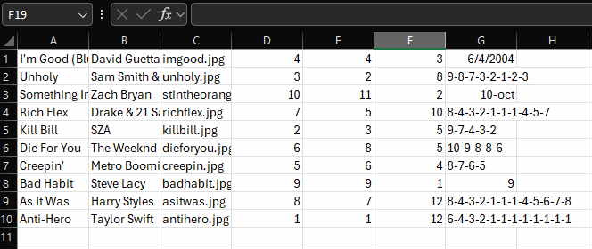
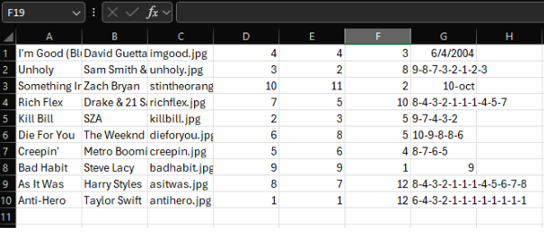
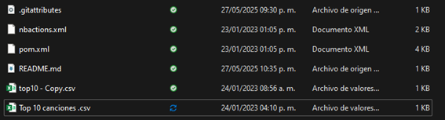

# Taller01-Ramas
Taller1 de la materia Diseño de Software
<<<<<<< HEAD

=======
<<<<<<< HEAD
# Seccion B integrante 3

# Seccion B Integrante 2

#Seccion B Lider

>>>>>>> 9c982c7136e3649649524fd2f39626cfb745d589
